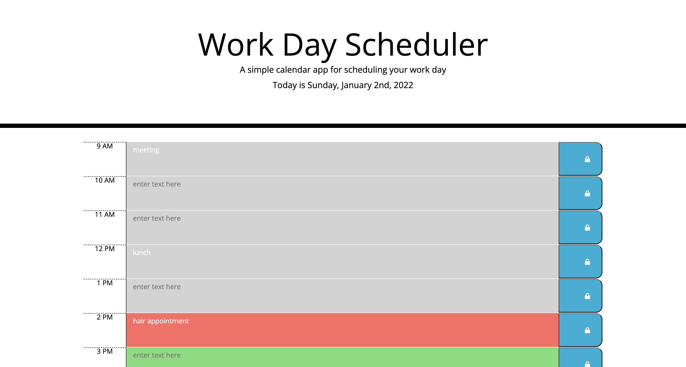

# Module Five Challenge: Work Day Scheduler

## Purpose
The challenge this week was create a simple calendar application that allows a user to save events for each hour of the day. This app runs in the browser and features dynamically updated HTML and CSS powered by jQuery. The application also uses the Moment.js library to work with the date and time. 

## Built With
* HTML
* CSS
* Javascript
* jQuery

## Website
https://lindseymiller2567.github.io/work-day-scheduler/

## Contribution
Created by Lindsey Dubnicka

## Screen Shot of Portfolio web page
